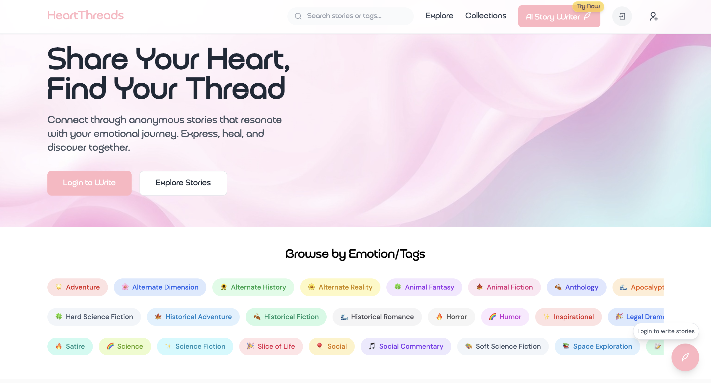

# HeartThreads – AI-Powered Storytelling Platform ✍️💡

**HeartThreads** is a modern, AI-integrated story sharing and publishing platform built with the **MERN Stack** (MongoDB, Express.js, React.js, Node.js). It empowers users to write, publish, and explore engaging stories—enhanced by intelligent writing assistance powered by **multiple fallback AI models**.

---

## 🌟 Key Features

- 🖥️ **Modern UI** – Clean, responsive design with mobile-first UX
- 🔐 **JWT Auth** – Secure signup/login with token-based authentication
- 📚 **Story Collections** – Create stories with chapter-style layouts
- 📝 **AI Writing Assistant** – Multi-model support with auto-fallback logic
- 🎨 **Tone Customization** – Write in emotional styles (thriller, sad, romantic, etc.)
- 🔍 **Advanced Search** – Filter stories by tone, author, tags, or keywords
- 💬 **Community Tools** – Like, comment, and bookmark your favorite reads
- 📱 **Fully Responsive** – Seamless experience across all screen sizes

---

## 🤖 AI-Powered Logic

### 1. **Multi-Model Story Generation (Fallback Mechanism)**
- Sends prompts to **primary LLM (e.g., OpenAI GPT)**.
- On failure, auto-switches to a **secondary model** (e.g., Cohere, HuggingFace).
- Output normalized via unified schema for consistent story quality.

✅ Ensures resilience, availability, and uninterrupted generation.

### 2. **Emotion & Tone Control**
- Users select tone (e.g., inspirational, suspense).
- Dynamic prompt templates adjust AI style for personalized output.

### 3. **Engagement-Driven Ranking**
- Stories ranked by likes, comments, and bookmarks.
- Promotes high-quality content via organic user interaction.

---

## 🛠️ Tech Stack

| Layer        | Tools/Libraries                            |
|--------------|--------------------------------------------|
| Frontend     | React.js, Tailwind CSS                     |
| Backend      | Node.js, Express.js                        |
| Database     | MongoDB Atlas                              |
| AI Models    | OpenAI API, Fallback Handlers              |
| Auth         | JSON Web Tokens (JWT)                      |
| Deployment   | Vercel (Frontend), Render/Firebase (Backend) |

---

## 📁 Folder Structure

heartthreads/
├── client/ → React.js frontend
├── server/ → Express.js backend
├── models/ → MongoDB schemas
├── routes/ → API endpoints
├── ai/ → AI logic & fallback system
└── utils/ → Helper utilities

---

## 🧪 Setup Instructions

> **Note**: This project is currently private. Forking/cloning is disabled.

To run locally:
```bash
# Install dependencies
npm install

# Create .env file for API keys and secrets
touch .env

# Start development server
npm run dev

## SCREENSHOTs
### 🏠 Homepage


👨‍💻 Creator
Built with ❤️ by Hamza Ayaz Khan
